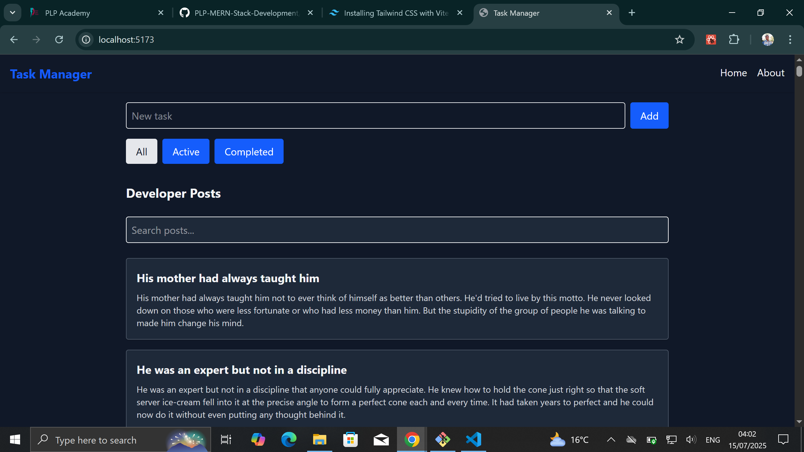

# 🧠 React Task Manager

A modern task management app built with **React**, **Tailwind CSS**, and **Vite**. It helps developers manage tasks, browse posts with infinite scroll, search through posts, and switch between light/dark modes.

---

## 📸 Screenshots


### 🌙 home



---

## 🚀 Features

- ✅ Add, complete, delete tasks
- 🔀 Filter tasks: All | Active | Completed
- 🌐 Fetch posts from DummyJSON API
- 🔄 Infinite scroll for post loading
- 🔍 Live search filter on API results
- 🌓 Light / Dark mode toggle
- 💡 Custom reusable components (Buttons, Cards, Layout, etc.)
- ⚙️ Theme managed via `useContext`
- 📁 State persisted in `localStorage`

---

## 🏗️ Project Structure

```bash
my-task-manager/
├── index.html
├── .env
├── package.json
├── screenshots/
│   └── home.png
└── src/
    ├── api/
    │   └── fetchPosts.js
    ├── components/
    │   ├── Button.jsx
    │   ├── Card.jsx
    │   ├── Footer.jsx
    │   ├── Layout.jsx
    │   ├── Navbar.jsx
    │   ├── Posts.jsx
    │   └── TaskManager.jsx
    ├── context/
    │   ├── ThemeProvider.jsx
    │   └── ThemeContext.js
    ├── hooks/
    │   └── useLocalStorage.js
    ├── pages/
    │   ├── Home.jsx
    │   └── About.jsx
    ├── App.jsx
    ├── main.jsx
    └── index.css

## Installation
git clone https://github.com/PLP-MERN-Stack-Development/week-3-react-js-assignment-willy-havertz.git
cd task-manager
npm install

## env
VITE_API_BASE_URL=https://dummyjson.com
```
